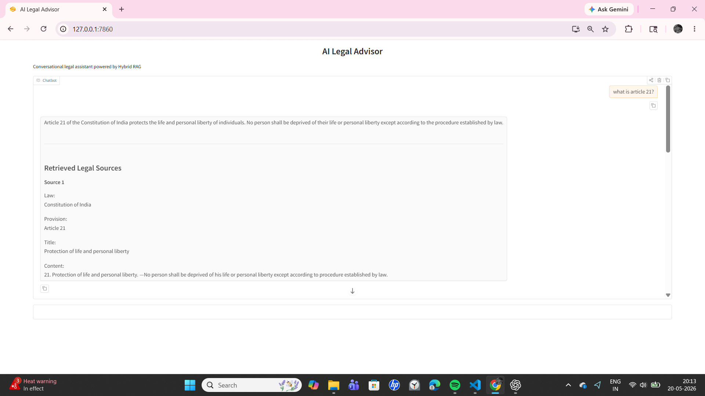
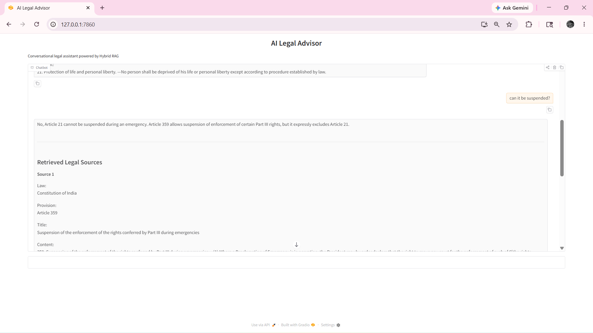
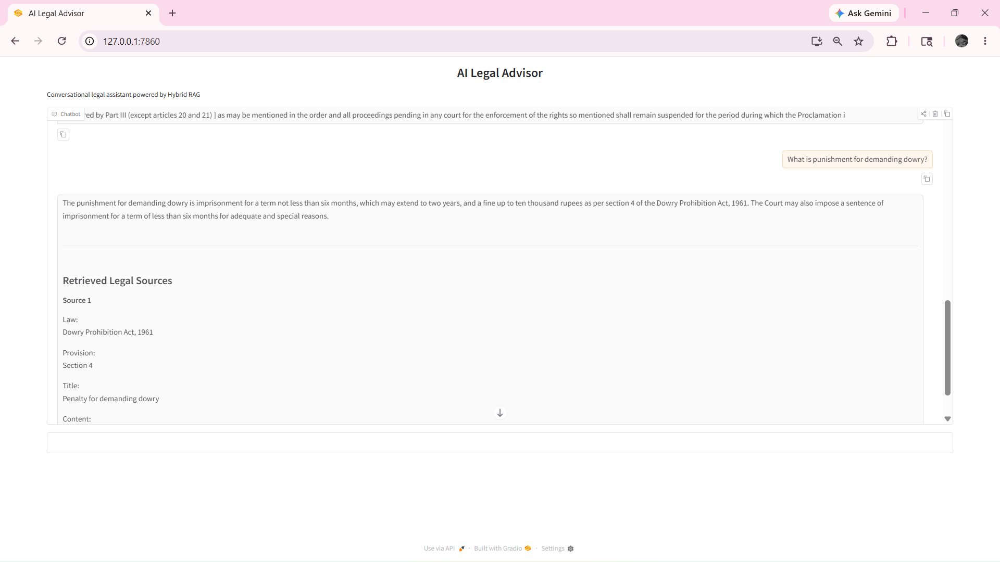

# AI Legal Advisor

A Hybrid RAG-based conversational legal assistant for Indian legal documents.  
It answers user queries using retrieved legal sources from uploaded PDFs and provides source-grounded responses.

## Features

- Hybrid Retrieval using Semantic Search + BM25
- FAISS Vector Database
- Sentence Transformer Embeddings
- Query Expansion for Legal Terminology
- Rule-based Retrieval Boosting
- Conversational Follow-up Handling
- Source-grounded Legal Responses
- Gradio-based Chat Interface
- Retrieval Evaluation and Benchmarking
- Top-K and Top-1 Retrieval Metrics

## Legal Documents Used

- Constitution of India
- Dowry Prohibition Act, 1961
- Protection of Women from Domestic Violence Act, 2005

## Tech Stack

- Python
- LangChain
- FAISS
- BM25
- Sentence Transformers
- Gradio
- OpenRouter API

## Project Structure

```bash
ai-legal-advisor/

│── app/
│   │
│   ├── evaluation/
│   │   └── evaluate_retrieval.py
│   │
│   ├── ingestion/
│   │   ├── document_loader.py
│   │   ├── legal_structure_parser.py
│   │   ├── metadata_processor.py
│   │   ├── text_chunker.py
│   │   └── vector_builder.py
│   │
│   ├── llm/
│   │   └── openrouter_client.py
│   │
│   ├── prompts/
│   │   └── legal_prompt.py
│   │
│   ├── retrieval/
│   │   ├── hybrid_retriever.py
│   │   ├── retriever.py
│   │   └── vector_store.py
│   │
│   ├── utils/
│   │   └── config.py
│   │
│   ├── main.py
│   └── rag_pipeline.py
│
│── data/
│   └── legal_docs/
│
│── screenshots/
│   ├── LA1.png
│   ├── LA2.png
│   └── LA3.png
│
│── tests/
│
│── requirements.txt
│── README.md
│── .gitignore
```

## Installation

```bash
git clone <your-repository-url>

cd ai-legal-advisor

pip install -r requirements.txt
```

## Environment Variables

Create a `.env` file in the project root:

```env
OPENROUTER_API_KEY=your_api_key
```

## Build Vector Database

Run the ingestion pipeline before starting the app:

```bash
python -m app.ingestion.vector_builder
```

## Run Application

```bash
python -m app.main
```

The Gradio app will run locally at:

```bash
http://127.0.0.1:7860
```

## Evaluation

Run retrieval benchmark evaluation:

```bash
python -m app.evaluation.evaluate_retrieval
```

### Current Retrieval Performance

| Metric | Score |
|---|---:|
| Top-K Retrieval Accuracy | 90.91% |
| Top-1 Retrieval Accuracy | 90.91% |

Evaluation was performed on a small custom legal query dataset covering Constitution, Dowry Prohibition Act, and Domestic Violence Act queries.

## Screenshots

### Article 21 Query



### Article 21 Suspension Follow-up



### Dowry Law Query




## Example Questions

- What is Article 21?
- Can Article 21 be suspended during emergency?
- Can Article 19 be suspended?
- What are writs?
- What is punishment for demanding dowry?
- What can a Dowry Prohibition Officer do?
- Does verbal abuse come under domestic violence?
- Can emotional abuse be domestic violence?

## Limitations

- This project is for educational and demonstration purposes only.
- It does not provide professional legal advice.
- The evaluation dataset is small and domain-specific.
- The system depends on the quality of retrieved legal document chunks.
- More legal documents and larger test sets are needed for production-level reliability.

## Future Improvements

- Cross-encoder reranking
- Legal-specific embedding models
- Larger evaluation dataset
- Better citation ranking
- Streaming responses
- Cloud deployment
- User authentication and chat history
- Support for more Indian laws and legal documents

## Disclaimer

This AI Legal Advisor is an educational project.  
It should not be treated as a substitute for professional legal advice.  
For real legal issues, users should consult a qualified legal professional.

## Authors / Contributors

- Ganta Naga Venkata Mounika — Retrieval pipeline, query handling, evaluation workflow, and system integration
- Bhargav Balaram Ramajukatum — RAG development support and research analysis
- Gummadi Sarveswar Raj — Backend support, testing, and validation
- Chapalamadugu Vasavi — Legal document collection and documentation

## Project Guide

- Aravind Chandran